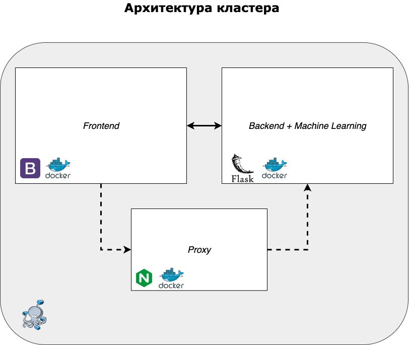

# Информационная система "Наука"

В данном репозитории находится решение кейса от РГЭУ (РИНХ) для финала хакатона "Цифровой прорыв". Ниже будут описаны подробности решения, а также видео с подробной демонстрацией прототипа.


## Содержание
- [Инструкция по установке](https://github.com/ilia2108/RINH_LeadersOfDigital#%D0%B8%D0%BD%D1%81%D1%82%D1%80%D1%83%D0%BA%D1%86%D0%B8%D1%8F-%D0%BF%D0%BE-%D1%83%D1%81%D1%82%D0%B0%D0%BD%D0%BE%D0%B2%D0%BA%D0%B5)
- [Постановка задачи](https://github.com/ilia2108/RINH_LeadersOfDigital#%D0%BF%D0%BE%D1%81%D1%82%D0%B0%D0%BD%D0%BE%D0%B2%D0%BA%D0%B0-%D0%B7%D0%B0%D0%B4%D0%B0%D1%87%D0%B8)
- [Решение. Сценарии использования](https://github.com/ilia2108/RINH_LeadersOfDigital#%D1%80%D0%B5%D1%88%D0%B5%D0%BD%D0%B8%D0%B5-%D1%81%D1%86%D0%B5%D0%BD%D0%B0%D1%80%D0%B8%D0%B8-%D0%B8%D1%81%D0%BF%D0%BE%D0%BB%D1%8C%D0%B7%D0%BE%D0%B2%D0%B0%D0%BD%D0%B8%D1%8F)
  - [Обычный пользователь](https://github.com/ilia2108/RINH_LeadersOfDigital#%D0%BE%D0%B1%D1%8B%D1%87%D0%BD%D1%8B%D0%B9-%D0%BF%D0%BE%D0%BB%D1%8C%D0%B7%D0%BE%D0%B2%D0%B0%D1%82%D0%B5%D0%BB%D1%8C)
  - [Администратор](https://github.com/ilia2108/RINH_LeadersOfDigital#%D0%BE%D0%B1%D1%8B%D1%87%D0%BD%D1%8B%D0%B9-%D0%BF%D0%BE%D0%BB%D1%8C%D0%B7%D0%BE%D0%B2%D0%B0%D1%82%D0%B5%D0%BB%D1%8C)
  - [Приглашенный специалист](https://github.com/ilia2108/RINH_LeadersOfDigital#%D0%BF%D1%80%D0%B8%D0%B3%D0%BB%D0%B0%D1%88%D0%B5%D0%BD%D0%BD%D1%8B%D0%B9-%D1%81%D0%BF%D0%B5%D1%86%D0%B8%D0%B0%D0%BB%D0%B8%D1%81%D1%82)
- [Архитектура](https://github.com/ilia2108/RINH_LeadersOfDigital#%D1%80%D0%B5%D1%88%D0%B5%D0%BD%D0%B8%D0%B5-%D1%81%D1%86%D0%B5%D0%BD%D0%B0%D1%80%D0%B8%D0%B8-%D0%B8%D1%81%D0%BF%D0%BE%D0%BB%D1%8C%D0%B7%D0%BE%D0%B2%D0%B0%D0%BD%D0%B8%D1%8F)
  - [Фронтенд](https://github.com/ilia2108/RINH_LeadersOfDigital#%D0%BF%D1%80%D0%B8%D0%B3%D0%BB%D0%B0%D1%88%D0%B5%D0%BD%D0%BD%D1%8B%D0%B9-%D1%81%D0%BF%D0%B5%D1%86%D0%B8%D0%B0%D0%BB%D0%B8%D1%81%D1%82)
  - [Бекенд](https://github.com/ilia2108/RINH_LeadersOfDigital#%D0%BF%D1%80%D0%B8%D0%B3%D0%BB%D0%B0%D1%88%D0%B5%D0%BD%D0%BD%D1%8B%D0%B9-%D1%81%D0%BF%D0%B5%D1%86%D0%B8%D0%B0%D0%BB%D0%B8%D1%81%D1%82)
  - [Модель машинного обучения](https://github.com/ilia2108/RINH_LeadersOfDigital#%D0%BC%D0%BE%D0%B4%D0%B5%D0%BB%D1%8C-%D0%BC%D0%B0%D1%88%D0%B8%D0%BD%D0%BD%D0%BE%D0%B3%D0%BE-%D0%BE%D0%B1%D1%83%D1%87%D0%B5%D0%BD%D0%B8%D1%8F)
- [Демонстрация решения](https://github.com/ilia2108/RINH_LeadersOfDigital#%D1%80%D0%B5%D1%88%D0%B5%D0%BD%D0%B8%D0%B5-%D1%81%D1%86%D0%B5%D0%BD%D0%B0%D1%80%D0%B8%D0%B8-%D0%B8%D1%81%D0%BF%D0%BE%D0%BB%D1%8C%D0%B7%D0%BE%D0%B2%D0%B0%D0%BD%D0%B8%D1%8F)
- [Направления дальнейшей разработки](https://github.com/ilia2108/RINH_LeadersOfDigital#%D1%80%D0%B5%D1%88%D0%B5%D0%BD%D0%B8%D0%B5-%D1%81%D1%86%D0%B5%D0%BD%D0%B0%D1%80%D0%B8%D0%B8-%D0%B8%D1%81%D0%BF%D0%BE%D0%BB%D1%8C%D0%B7%D0%BE%D0%B2%D0%B0%D0%BD%D0%B8%D1%8F)

## Инструкция по установке
Посмотреть рабочий прототип сайта можно увидеть по [ссылке](https://leaders.bss.design/). Однако, в нем нет логики. Чтобы протестировать логику необходимо выполнить следующие действия:
1. Установить **Docker** на свой компьютер. Его можно скачать [здесь](https://www.docker.com/products/docker-desktop);
2. Склонировать этот репозиторий любым из способов;
3. Перейти в директорию с репозиторием и запустить команду ```docker-compose up``` или ```docker-compose up --build```.
## Постановка задачи
Проблематика кейса четко была обозначена заказчиком. Она заключается в **слабой систематизации научных достижений сотрудников** и **некачественной визуализации научной деятельности**. 

Однако, начав изучение научной деятаельности универститета и самой предметной области, мы пришли к выводу, что есть еще некоторые проблемы, которые не были учтены в постановке кейса, а именно:
- РГЭУ (РИНХ) имел некоторые репутационные проблемы [в связи со скандалом](https://ru.wikipedia.org/wiki/%D0%A0%D0%BE%D1%81%D1%82%D0%BE%D0%B2%D1%81%D0%BA%D0%B8%D0%B9_%D0%B3%D0%BE%D1%81%D1%83%D0%B4%D0%B0%D1%80%D1%81%D1%82%D0%B2%D0%B5%D0%BD%D0%BD%D1%8B%D0%B9_%D1%8D%D0%BA%D0%BE%D0%BD%D0%BE%D0%BC%D0%B8%D1%87%D0%B5%D1%81%D0%BA%D0%B8%D0%B9_%D1%83%D0%BD%D0%B8%D0%B2%D0%B5%D1%80%D1%81%D0%B8%D1%82%D0%B5%D1%82#%D0%9A%D1%80%D0%B8%D1%82%D0%B8%D0%BA%D0%B0), связанным с недостаточным уровнем уникальности работ некоторых научных сотрудников университета. Таким образом, возникает **необходимость в проверке научных работ на плагиат**;
- На сегоднящний день наблюдается существенная текучка кадров, которая сказывается в том числе и на научном потенциале РГЭУ (РИНХ). Таким образом, есть **необходимость мотивировать сторонних научных работников** принимать участие в проектах университета. 

## Решение. Сценарии использования
В качестве решения мы предлагаем создать информационную систему, которая бы одновременно отвечала требованиям университета и соответствовала современным технологическим стандартам.

Ниже представлена диаграмма сценариев использования системы пользователями с тремя потенциальными ролями: **администратор, обычный пользователь и приглашенный специалист**:

### Обычный пользователь
Это основной вид пользователя. Это люди, которые являются научными сотрудниками университета. Они могут добавлять свои достижения в личном кабинете, а также создавать команды исследователей. Помимо этого они могут присоединиться к исследованию. Все члены команды имеют доступ к странице с инфографикой по проекту, которую можно экспортировать в pdf. 
### Администратор
Пользователь с правами администратора имеет доступ к полной верхнеуровевой аналитике исследовательской деятельности университета. Эта аналитика тоже может быть экспортирована в pdf.
### Приглашенный специалист
Это научные специалисты, которые не работают в данном университете. Они не могут создавать команды, однако могут присоединиться к уже существующим или только формирующимся. 

## Архитектура

Осознавая важность задачи, мы создали **микросервисную архитектуру**, которая не является перегруженной и отвечает всем стандартам безопасности. Она состоит из четырех кусков: **фронтенд, бекенд, модель ML** и прокси (не реализован в ходе хакатона). Каждый из кусков является **Docker контейнером**, которые оркестрируются в Docker Compose. Таким образом, решение сможет с легкостью масштабироваться в случае увеличивающейся нагрузки. 


### Фронтенд
Эта часть написана на html/css/js с использованием библиотеки Bootstrap. Мы реализовали две части: портал участника и администратора. Аутентификация не использовалась, только два интерфейса. 
### Бекенд
Тут использовался Flask и язык программирования Python. Здесь же хранятся и данные. На данный момент это SQLite, но мы планируем использовать другую СУБД. 
### Модель машинного обучения
Мы осознаем, что в рамках хакатона невозможно сделать решение, готовое к продуктовому релизу в виду ограниченных ресурсов. Однако, мы хотим поделиться двумя моделями решения. Одну мы сделали за хакатон, а вторая - методология в "идеальном мире", которую мы готовы реализовать при наличии должных ресурсов. 

### Что мы сделали за хакатон
В рамках хакатона мы реализовали модель анализа, состоящую из трех компонентов:
1. Суммаризация текста для передачи информации в статье в самом кратком изложении. Текст уменьшается в 2-10 раз. ё
2. Анализ ключевых слов в аннотации, сравнение с компетенциями пользователя
3. Анализ тональности рецензий на пользователей и на их исследования
4. Семантическая близость компетенций
### Как мы видим идеальное решение задачи
В идеале для решения задачи нам потребуется пройти два этапа:
1. Провести исследование с целью создания датасета на 100 тыс. записей краткого описания проектов и нанятых кандидатур с их характеристиками (например - вакансии в компаниях и нанятые сотрудники с их портфолио). Возможно использовать источники вроде HeadHunter, но также важно и самим собирать данные. 
2. У нас есть гипотеза, что нашу задачу решает модель GPT3. Мы попробовали ее российский аналог, однако результат был скорее отрицательный. Мы хотим получить доступ к этой модели (занимает около месяца) и сделать тюнинг этой модели. Мы считаем, что таким образом мы значительно повысим качество работы нашего интеллектуального модуля. 
## Демонстрация решения


## Направления дальнейшей разработки
В качестве направлений дальнейших разработок мы хотим сделать следующие изменения:
- Сделать **авторизацию пользоваталей** с использованием OAuth;
- **Изменить вид баз данных** с SQLite и **добавить новый контейнер** с базой данных
- Имплементировать уведомление научных сотрудников о новых проектах по их тематике;
- Реализовать **прокси на nginx** в соответствии с [архитектурой](https://github.com/ilia2108/RINH_LeadersOfDigital#%D0%B0%D1%80%D1%85%D0%B8%D1%82%D0%B5%D0%BA%D1%82%D1%83%D1%80%D0%B0);
- **Дополнить модель** машинного обучения в соответствии с [методологией оценки исследования и научного работника](https://github.com/ilia2108/RINH_LeadersOfDigital#%D1%80%D0%B5%D1%88%D0%B5%D0%BD%D0%B8%D0%B5-%D1%81%D1%86%D0%B5%D0%BD%D0%B0%D1%80%D0%B8%D0%B8-%D0%B8%D1%81%D0%BF%D0%BE%D0%BB%D1%8C%D0%B7%D0%BE%D0%B2%D0%B0%D0%BD%D0%B8%D1%8F);
- Интегрировать сервис с API от **[Scopus](https://pybliometrics.readthedocs.io/en/stable/), [Web of Science](https://pypi.org/project/wos/) и [eLibrary](https://www.elibrary.ru/projects/api/api_info.asp)**, так как они не были доступны в рамках хакатона.
