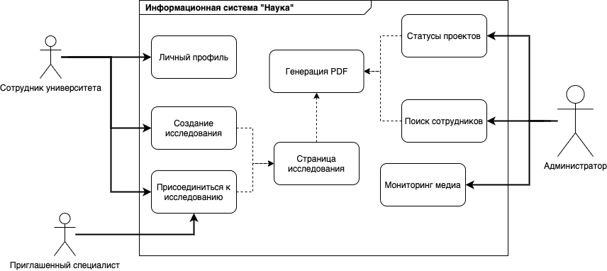
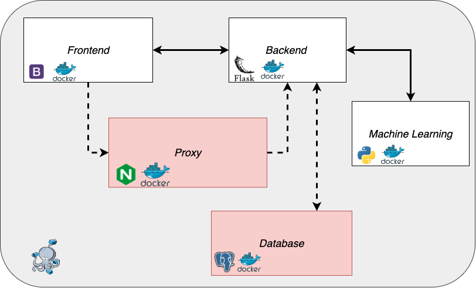
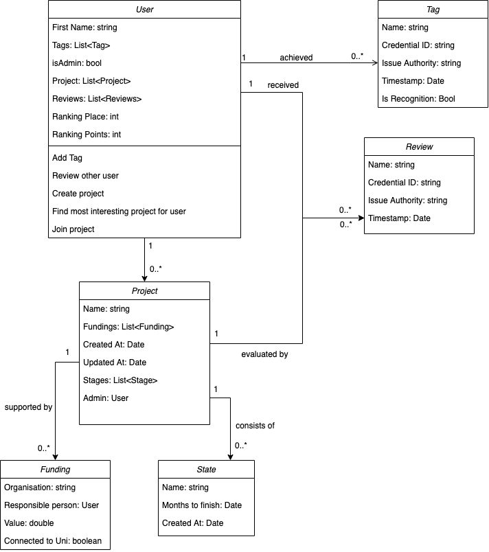

# Информационная система "Наука"

В данном репозитории находится решение кейса от РГЭУ (РИНХ) для финала хакатона "Цифровой прорыв". Ниже будут описаны подробности решения, а также видео с подробной демонстрацией прототипа.

## Содержание
- [Инструкция по установке](https://github.com/ilia2108/RINH_LeadersOfDigital#%D0%B8%D0%BD%D1%81%D1%82%D1%80%D1%83%D0%BA%D1%86%D0%B8%D1%8F-%D0%BF%D0%BE-%D1%83%D1%81%D1%82%D0%B0%D0%BD%D0%BE%D0%B2%D0%BA%D0%B5)
  - [С использованием Docker](https://github.com/ilia2108/RINH_LeadersOfDigital#%D1%81-%D0%B8%D1%81%D0%BF%D0%BE%D0%BB%D1%8C%D0%B7%D0%BE%D0%B2%D0%B0%D0%BD%D0%B8%D0%B5%D0%BC-docker)
  - [Тестирование алгоритмов](https://github.com/ilia2108/RINH_LeadersOfDigital#%D1%82%D0%B5%D1%81%D1%82%D0%B8%D1%80%D0%BE%D0%B2%D0%B0%D0%BD%D0%B8%D0%B5-%D0%B0%D0%BB%D0%B3%D0%BE%D1%80%D0%B8%D1%82%D0%BC%D0%BE%D0%B2-%D0%BF%D0%BE%D0%B4%D0%B1%D0%BE%D1%80%D0%B0-%D0%BA%D0%B0%D0%BD%D0%B4%D0%B8%D0%B4%D0%B0%D1%82%D0%BE%D0%B2-%D0%BD%D0%B0-%D0%BF%D1%80%D0%BE%D0%B5%D0%BA%D1%82-%D0%B1%D0%B5%D0%B7-docker)
- [Постановка задачи](https://github.com/ilia2108/RINH_LeadersOfDigital#%D0%BF%D0%BE%D1%81%D1%82%D0%B0%D0%BD%D0%BE%D0%B2%D0%BA%D0%B0-%D0%B7%D0%B0%D0%B4%D0%B0%D1%87%D0%B8)
- [Решение. Сценарии использования](https://github.com/ilia2108/RINH_LeadersOfDigital#%D1%80%D0%B5%D1%88%D0%B5%D0%BD%D0%B8%D0%B5-%D1%81%D1%86%D0%B5%D0%BD%D0%B0%D1%80%D0%B8%D0%B8-%D0%B8%D1%81%D0%BF%D0%BE%D0%BB%D1%8C%D0%B7%D0%BE%D0%B2%D0%B0%D0%BD%D0%B8%D1%8F)
  - [Обычный пользователь](https://github.com/ilia2108/RINH_LeadersOfDigital#%D0%BE%D0%B1%D1%8B%D1%87%D0%BD%D1%8B%D0%B9-%D0%BF%D0%BE%D0%BB%D1%8C%D0%B7%D0%BE%D0%B2%D0%B0%D1%82%D0%B5%D0%BB%D1%8C)
  - [Администратор](https://github.com/ilia2108/RINH_LeadersOfDigital#%D0%BE%D0%B1%D1%8B%D1%87%D0%BD%D1%8B%D0%B9-%D0%BF%D0%BE%D0%BB%D1%8C%D0%B7%D0%BE%D0%B2%D0%B0%D1%82%D0%B5%D0%BB%D1%8C)
  - [Приглашенный специалист](https://github.com/ilia2108/RINH_LeadersOfDigital#%D0%BF%D1%80%D0%B8%D0%B3%D0%BB%D0%B0%D1%88%D0%B5%D0%BD%D0%BD%D1%8B%D0%B9-%D1%81%D0%BF%D0%B5%D1%86%D0%B8%D0%B0%D0%BB%D0%B8%D1%81%D1%82)
- [Архитектура](https://github.com/ilia2108/RINH_LeadersOfDigital#%D1%80%D0%B5%D1%88%D0%B5%D0%BD%D0%B8%D0%B5-%D1%81%D1%86%D0%B5%D0%BD%D0%B0%D1%80%D0%B8%D0%B8-%D0%B8%D1%81%D0%BF%D0%BE%D0%BB%D1%8C%D0%B7%D0%BE%D0%B2%D0%B0%D0%BD%D0%B8%D1%8F)
  - [Фронтенд](https://github.com/ilia2108/RINH_LeadersOfDigital#%D0%BF%D1%80%D0%B8%D0%B3%D0%BB%D0%B0%D1%88%D0%B5%D0%BD%D0%BD%D1%8B%D0%B9-%D1%81%D0%BF%D0%B5%D1%86%D0%B8%D0%B0%D0%BB%D0%B8%D1%81%D1%82)
  - [Бекенд](https://github.com/ilia2108/RINH_LeadersOfDigital#%D0%BF%D1%80%D0%B8%D0%B3%D0%BB%D0%B0%D1%88%D0%B5%D0%BD%D0%BD%D1%8B%D0%B9-%D1%81%D0%BF%D0%B5%D1%86%D0%B8%D0%B0%D0%BB%D0%B8%D1%81%D1%82)
  - [Модель машинного обучения](https://github.com/ilia2108/RINH_LeadersOfDigital#%D0%BC%D0%BE%D0%B4%D0%B5%D0%BB%D1%8C-%D0%BC%D0%B0%D1%88%D0%B8%D0%BD%D0%BD%D0%BE%D0%B3%D0%BE-%D0%BE%D0%B1%D1%83%D1%87%D0%B5%D0%BD%D0%B8%D1%8F)
- [Демонстрация решения](https://github.com/ilia2108/RINH_LeadersOfDigital#%D1%80%D0%B5%D1%88%D0%B5%D0%BD%D0%B8%D0%B5-%D1%81%D1%86%D0%B5%D0%BD%D0%B0%D1%80%D0%B8%D0%B8-%D0%B8%D1%81%D0%BF%D0%BE%D0%BB%D1%8C%D0%B7%D0%BE%D0%B2%D0%B0%D0%BD%D0%B8%D1%8F)
- [Направления дальнейшей разработки](https://github.com/ilia2108/RINH_LeadersOfDigital#%D1%80%D0%B5%D1%88%D0%B5%D0%BD%D0%B8%D0%B5-%D1%81%D1%86%D0%B5%D0%BD%D0%B0%D1%80%D0%B8%D0%B8-%D0%B8%D1%81%D0%BF%D0%BE%D0%BB%D1%8C%D0%B7%D0%BE%D0%B2%D0%B0%D0%BD%D0%B8%D1%8F)

## Инструкция по установке
### С использованием Docker
Посмотреть рабочий прототип сайта можно увидеть по [ссылке](https://leaders.bss.design/). Однако, в нем нет логики. Чтобы протестировать логику необходимо выполнить следующие действия:
1. Установить **Docker** на свой компьютер. Его можно скачать [здесь](https://www.docker.com/products/docker-desktop);
2. Склонировать этот репозиторий любым из способов;
3. Перейти в директорию с репозиторием и запустить команду ```docker-compose up``` или ```docker-compose up --build```.

### Тестирование алгоритмов подбора кандидатов на проект без Docker
Ниже приведено видео тестирования (необходимо нажать на картинку, чтобы открыть видео):

[](https://youtu.be/HlCrs5hwq8Q "Видео тестирования")

Если вы хотите сами потестировать, то вам необходимо выполнить следующее:
1. Необходимо **скачать или клонировать репозиторий**;
2. Перейти в папку **ML** и выполнить ```pip install -r requirements.txt```;
3. Для запуска сервера выполнить  ```python server.py```;
4. При "Error 403" необходимо загрузить модель ('https://storage.b-labs.pro/models/fasttext-social-network-model.bin') и перенести ее в папку репозитория,
после чего повторить пункт 3;
5. Первый запуск может занять некоторое время. Во время запуска устанавливается сразу несколько моделей;
6. Для тестирования запустить  ```python test.py```;
7. Дополнительную информацию по работе алгоритма можно также найти в ```server.py```, после чего можно отредактировать ```test.py``` для собственных тестов.

### Тестирование интерфейса
Возможно 2-я способами: 
1.  Переход по ссылке ('https://leaders.bss.design/') 
2.  Использование страниц из репозитория в папке ```frontend```
  
  Ниже приведено видео тестирования (необходимо нажать на картинку, чтобы открыть видео):
  
[](https://youtu.be/lExXNzMErrc "Видео тестирования")

### Тестирование начального сайта с ML алгоритмом (Два сервера с Flask)
Если вы хотите сами потестировать, то вам необходимо выполнить следующее:
1. Необходимо **скачать или клонировать репозиторий**;
2. Перейти в папку **ML** и выполнить ```pip install -r requirements.txt```;
3. Для запуска сервера выполнить  ```python server.py```;
4. При "Error 403" необходимо загрузить модель ('https://storage.b-labs.pro/models/fasttext-social-network-model.bin') и перенести ее в папку репозитория,
после чего повторить пункт 3;
5. Первый запуск может занять некоторое время. Во время запуска устанавливается сразу несколько моделей;
6. Создать еще одну командую строку
7. Перейти в папку **flask** и там запустить ```pip install -r requirements.txt```;
8. Выполнить  ```flask run```
9. В окне появится адрес сайта. Переходим по нему и заполняем критерии. После кнопки подтверждения
будет отправлен http запрос на сервер ML. Ответом будет редирект на страничку с листом подобранных под проект кандидатов.

[](https://youtu.be/_Z5PRIEPu0M "Видео тестирования")


## Постановка задачи
Проблематика кейса четко была обозначена заказчиком. Она заключается в **трудности поиска в научные проекты специалистов с необходимыми навыками как внутри ВУЗа, так и вне стен образовательного учереждения**, **слабой систематизации научных достижений сотрудников** и **некачественной визуализации научной деятельности**. 

Однако, начав изучение научной деятаельности универститета и самой предметной области, мы пришли к выводу, что есть еще некоторые проблемы, которые не были учтены в постановке кейса, а именно:
- РГЭУ (РИНХ) имел некоторые репутационные проблемы [в связи со скандалом](https://ru.wikipedia.org/wiki/%D0%A0%D0%BE%D1%81%D1%82%D0%BE%D0%B2%D1%81%D0%BA%D0%B8%D0%B9_%D0%B3%D0%BE%D1%81%D1%83%D0%B4%D0%B0%D1%80%D1%81%D1%82%D0%B2%D0%B5%D0%BD%D0%BD%D1%8B%D0%B9_%D1%8D%D0%BA%D0%BE%D0%BD%D0%BE%D0%BC%D0%B8%D1%87%D0%B5%D1%81%D0%BA%D0%B8%D0%B9_%D1%83%D0%BD%D0%B8%D0%B2%D0%B5%D1%80%D1%81%D0%B8%D1%82%D0%B5%D1%82#%D0%9A%D1%80%D0%B8%D1%82%D0%B8%D0%BA%D0%B0), связанным с недостаточным уровнем уникальности работ некоторых научных сотрудников университета. Таким образом, возникает **необходимость в проверке научных работ на плагиат**;
- На сегоднящний день наблюдается существенная текучка кадров, которая сказывается в том числе и на научном потенциале РГЭУ (РИНХ). Таким образом, есть **необходимость мотивировать сторонних научных работников** принимать участие в проектах университета. 

## Решение. Сценарии использования
В качестве решения мы предлагаем создать информационную систему, которая бы одновременно отвечала требованиям университета и соответствовала современным технологическим стандартам.

Ниже представлена диаграмма сценариев использования системы пользователями с тремя ролями: **администратор, обычный пользователь и приглашенный специалист**:

### Обычный пользователь
Это основной вид пользователя. Это люди, которые являются научными сотрудниками университета. Они могут добавлять свои достижения в личном кабинете, а также создавать команды исследователей. Помимо этого они могут присоединиться к исследованию. Все члены команды имеют доступ к странице с инфографикой по проекту, которую можно экспортировать в pdf. 
### Администратор
Пользователь с правами администратора имеет доступ к полной верхнеуровевой аналитике исследовательской деятельности университета. Эта аналитика тоже может быть экспортирована в pdf.
### Приглашенный специалист
Это научные специалисты, которые не работают в данном университете. Они не могут создавать команды, однако могут присоединиться к уже существующим или только формирующимся. 

## Архитектура

Осознавая важность задачи, мы создали **микросервисную архитектуру**, которая не является перегруженной и отвечает всем стандартам безопасности. Она состоит из четырех кусков: **фронтенд, бекенд, модель ML** и прокси (не реализован в ходе хакатона). Каждый из кусков является **Docker контейнером**, которые оркестрируются в Docker Compose. Таким образом, решение сможет с легкостью масштабироваться в случае увеличивающейся нагрузки. 
Ниже представлена архитектура полного решения:



### Фронтенд
Эта часть написана на html/css/js с использованием библиотеки Bootstrap. Мы реализовали две части: портал участника и администратора. Аутентификация не использовалась, только два интерфейса. 
### Бекенд
Тут использовался Flask и язык программирования Python. Здесь же хранятся и данные. На данный момент это SQLite, но мы планируем использовать другую СУБД. 
### Модель машинного обучения
В рамках хакатона была создана система отбора кандидатов для проектов с настраиваемыми параметрами (либо в ручную, либо адаптивными алгоритмами в реальной работе)
### Что мы сделали за хакатон
В рамках хакатона мы **реализовали систему**, состоящую из компонентов:
1. **Суммаризация** текста для передачи информации в статье в самом кратком изложении. Текст уменьшается в 2-15 раз.
Также ускоряет работу остальных блоков системы
2. **Лемматизация** (приведение слов к начальной форме)
3. **Анализ ключевых фраз** в аннотации к проекту и в статьях кандидата на проект
4. **Анализ тональности рецензий** на пользователей и на их исследования
5. **Семантическая близость** компетенций (между ключевыми фразами. Компетенция - необходимый навык для проекта/навык у кандидата) через NLP [модель](https://rusvectores.org/),
предобученную на "Национальном Корпусе Русского Языка".
6. **API Антиплагиата** на основе [text.ru](https://text.ru/). Неуникальные тексты в оценку пользователю не входят/вычитают баллы. 
7. Разработана **уникальная система весов**, корректирующих рекомендательную систему в зависимости от приоритетов (важен ли системе рейтинг, наличие статей, тегов и т.д.)
Веса могут быть настроены в ручную или же с использованием адаптивных алгоритмов для оптимальной настройки параметров (необходимо тестирование на реальных пользователях)
### Как мы видим идеальное решение задачи с использованием искусственного интеллекта
Для решения задачи нам потребуется пройти 4 этапа:
1. Провести исследование с целью создания датасета на 100 тыс. записей краткого описания проектов и нанятых кандидатур с их характеристиками (например - вакансии в компаниях и нанятые сотрудники с их портфолио).
Основные возможные источники для сбора данных: https://scistarter.org/, https://www.kolabtree.com/, https://glp.earth/find-scientist, https://collegegrad.com/jobs/
2. Выбор модели [ruGPT3](https://github.com/sberbank-ai/ruGPT3_demos)/[GPT3](https://ru.wikipedia.org/wiki/GPT-3) в зависимости от результатов пункта 3 
3. Предобучить (/тюнинг) на собранном датасете модель. Наша гипотеза состоит в том, что модель поможет доработать систему с помощью наиболее
эффективного анализа сути проекта и достижений кандидатов. Гипотеза основывается на количестве парметров модели (>100 млрд. при ориг GPT3) и гигантском датасете, который был использован для обучения. Сама модель без предобучения способна рекомендовать фильмы с IMDb только основываясь на собственных данных, находя сложные взаимосвязи в описании к фильмам и в рецензиях на них, поэтому мы в большей степени мы уверены в эффективности выбранного нами подхода. 
4. GPT3 также может взять на себя роль адаптивного алгоритма для весов или же полностью заменить разработанную рекомендательную систему из за преимущества в нахождении сложных взаимосвязей между проектом и кандидатами при должной доработке.
## Демонстрация решения


## Направления дальнейшей разработки
В качестве направлений дальнейших разработок мы хотим сделать следующие изменения:
- Сделать **авторизацию пользоваталей** с использованием OAuth;
- Добавить еще один [инструмент антиплагиата](https://docs.antiplagiat.ru/api/), поскольку именно. им пользуется университет. Информация из двух источников поможет улучшить качество существующего анализа;
- **Изменить вид баз данных** с SQLite и **добавить новый контейнер** с базой данных;
- Имплементировать **уведомление научных сотрудников** о новых проектах по их тематике;
- Реализовать **прокси на nginx** в соответствии с [архитектурой](https://github.com/ilia2108/RINH_LeadersOfDigital#%D0%B0%D1%80%D1%85%D0%B8%D1%82%D0%B5%D0%BA%D1%82%D1%83%D1%80%D0%B0);
- **Дополнить модель** машинного обучения в соответствии с [методологией оценки исследования и научного работника](https://github.com/ilia2108/RINH_LeadersOfDigital#%D1%80%D0%B5%D1%88%D0%B5%D0%BD%D0%B8%D0%B5-%D1%81%D1%86%D0%B5%D0%BD%D0%B0%D1%80%D0%B8%D0%B8-%D0%B8%D1%81%D0%BF%D0%BE%D0%BB%D1%8C%D0%B7%D0%BE%D0%B2%D0%B0%D0%BD%D0%B8%D1%8F);
- Интегрировать сервис с API от **[Scopus](https://pybliometrics.readthedocs.io/en/stable/), [Web of Science](https://pypi.org/project/wos/) и [eLibrary](https://www.elibrary.ru/projects/api/api_info.asp)**, так как они не были доступны в рамках хакатона.
